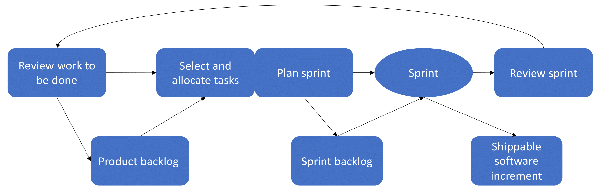
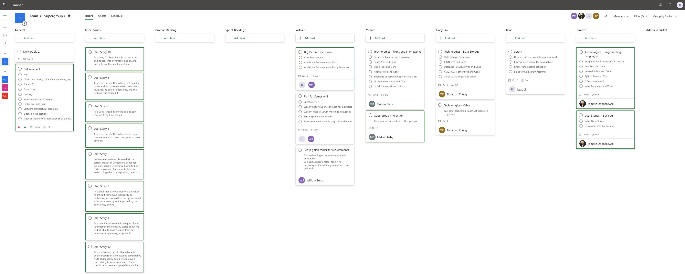
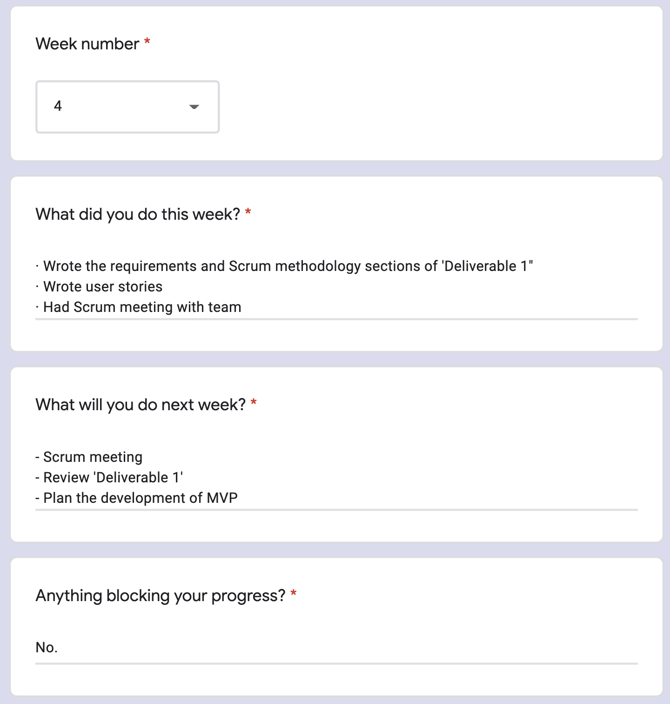
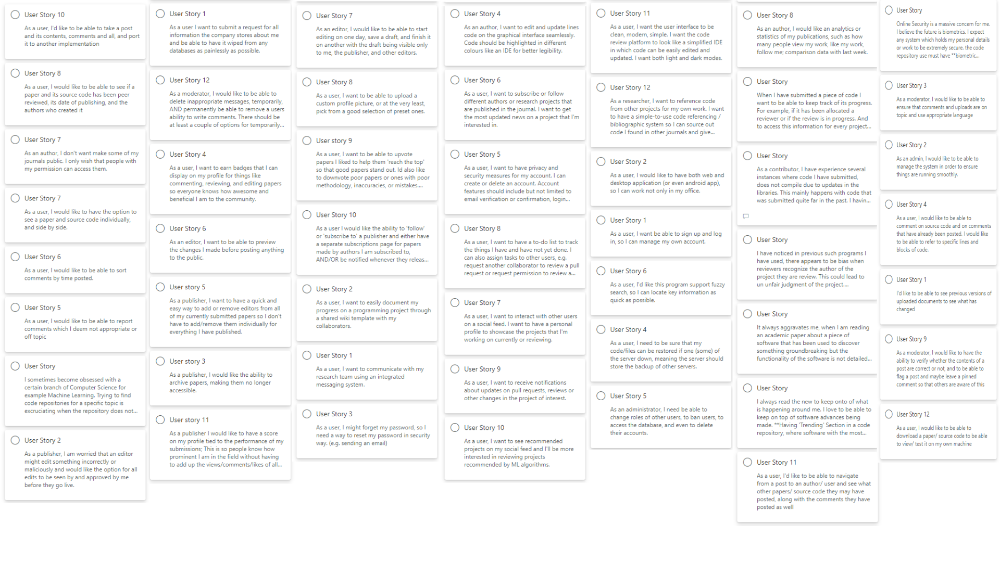
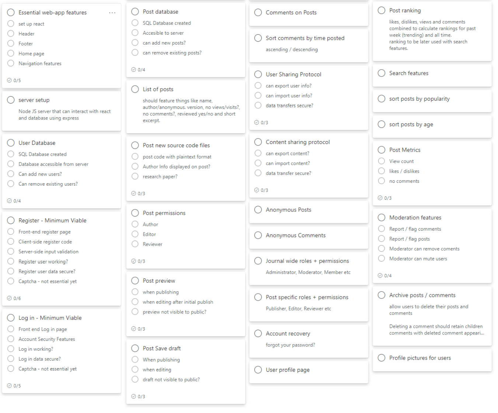
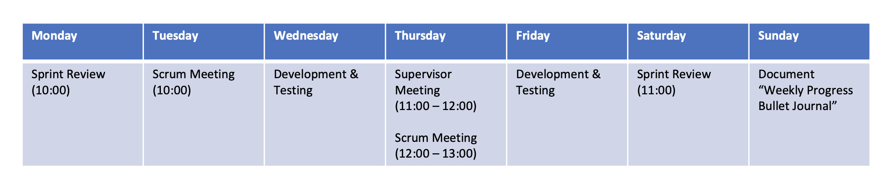

# Deliverable 1 Report

  ## Supergroup C - Team 3

| Name/ ID | Role |
| --- | --- |
| Edwin Brady | Supervisor |
| 190003657  | Git Master |
| 200012696 | Supergroup Rep |
| 190020048 | Scrum Master |
| 200013403 | Tester |
| 190013199 | Product Owner |

## Big Picture Discussion   *- 190020048 & 190003657*
### Core Requirements

After having looked at the user stories, we decided that the core requirements should be those that allow us to cover the bare minimum for the minimum viable product. Those being:
- Posting comments
- Creating a user profile
- Posting source code
- A simple web-based user interface
- Ability to move information to another coding journal

The posting of comments should be simple plain text to start with, and the user profile should be creatable through a user name and password.
Posting of typical code files like .java or .py should be possible. When uploaded, they should be viewable on the simple web-based user interface.
This interface will show a feed of posts that a user can click on and view. A post should consist of a title, a short description, the date and time it was created, and the name of the user who created it. 

Once a post has been opened, the title, description, time of creation, and creator should be visible at the top of the post. Below this will be the source code. To start with, there will be no syntax highlighting, only a line number followed by the line of code that it corresponds with. A user should be able to scroll both horizontally and vertically to view code that isn't visible on the screen at the time.

Below a post will be a list of comments posted by other users on the subject of the source code. These will consist of the user who created the comment, its time of creation, and the contents of the comment themselves. To create a comment, a textbox should be visible to the user from which they can enter what they would like to say into. A button beneath this text box should allow a user to save this comment and display it on their chosen post. Comments should be of a tree like structure. With the root node being the post itself, and branches being comment threads. Therefore allowing comments to be made on comments themselves.

A post, comments and all, should finally then be portable. Meaning that if a user wanted to share a post with another coding journal, they should be able to move the contents of a post along with everything associated with it to it. This could be implemented via a menu with a list of all the coding journals they could share the post to. A user would then be able to select a coding journal, or multiple, and then be able to share the post to these them.

### Additional Requirements

### Post Options

#### 
 Tags (Usernames, Posts, Code Citation) 

Tags provide a useful way to group related posts and they inform the reader about the category of posts which makes it easier for people to find relevant content. Editors will be able to assign or add new tags to posts before they publish them. If the tag has already been created for a previous post or page, the user input box will begin to auto-complete with matching tags. After the posts are tagged, the posts will then appear in the topic listings of any tags that the editor has used. Therefore, assigning tags to posts will increase the chance that other users will see the content. Tags could be used to suggest a **“relevant topic”** which indicates a specific category, “pending” or “peer-reviewed” to show **the status of the peer-review progress**, or **“user tags”** which allow editors to mention users or assign tasks. An advanced function of tags is to reference code from journals for personal projects. A user-friendly code referencing / bibliographic system allows sourcing code discovered in journals and give credit to other researchers. Advanced tags could also be used for **“code citation”**. Researchers might like to reference code from other projects for their work, so a user-friendly code citation or bibliographic tag system can give credit to fellow researchers of a journal. 

#### 
 Download Source Code and Upload of Various Document Types 

Users will be able to upload multiple file types and extensions to the code journal platform. To upload a new document to a project page or a post, users need to locate the document or drag and drop the document from its directory. Users can upload multiple assets within a folder by dragging and dropping them onto the uploader. Folder structures are not preserved when uploading folders. To download files or source code from the platform, users have the option to download a ZIP file that contains the entire journal or project content. The files will then be saved into a convenient directory on the user’s computer. 

#### 
 Reporting a Problem 

User feedback is crucial for software improvement and maintenance. Users can report abusive content, comments or spam on the platform by using a report link near the post itself. To report a comment, users can choose a comment they would like to report and give feedback that best describes how the comment is against community standards. The process will be similar for reporting a user profile. The collected feedback will then be analysed by the moderator of the post or project page before further action to remove the content or user profile by system administrators.

#### 
 Fuzzy-Search Box 

A search box is a graphical control element that has a dedicated function of accepting user input to be searched for in a database. The search bar will allow users to search the platform. Fuzzy string matching could be implemented as an advanced search function. Fuzzy search is more powerful than exact search in research or academic journals. This is because a fuzzy search can recognise foreign languages, unfamiliar or sophisticated terms. For example, the insertion operation will give a search result: “cat → cast”. Approximate string matching can be done by finding the approximate substrings inside a given string and finding dictionary strings that match the pattern approximately.

### Data Analytics

#### 
 Badges and User Score 

Badges are recognitions of achievements or significant contributions to a coding journal. To unlock a badge, users will need to make contributions to an open-source journal while adhering to a set of conditions or specific requirements. User scores also indicate the count of contributions (i.e. summary of pull requests, opened issues, and commits) to public journals on the platform. Both badges and user scores will be displayed on the user profile page and they serve to showcase personal achievements in the open-source code community. 

#### 
 Contribution Calendar and Activity Overview 

The contribution graph on a user profile page shows the activity or any contributions to public journal pages. Contributions (i.e. posting content, committing to a journal page, commenting, submitting a pull request) will be counted and visualised on the contribution calendar. Users will be able to check the contributions made during a specific period. The activity overview on the user section profile then filters the user’s contribution graph and activity timeline to visualise the different types of contribution using a radar chart. This is a useful feature to track the contributions and working progress of a project.

#### 
 Upvote or Downvote Posts 

When users are logged into the platform, they will be able to upvote or downvote posts to determine if the post is relevant to their interests. Users will get one vote per content posted and the number appearing next to the post is the submission score: the number of upvotes minus the number of downvotes. The vote data collected could then be processed for refining the recommender system.

#### 
 Recommender System 

A recommender system or recommendation algorithm could be used for tailored information filtering. The system predicts the preference a user would give to a post (i.e. votes, tags) and recommends relevant content to users. A content-based recommender system works well when descriptive data of the content is provided beforehand. Similarity scores are then calculated and measured against product attributes. On the other hand, a collaborative filtering recommender system is a model for user-item interactions where users and items representations have to be learned from an interaction matrix. Advanced machine learning algorithms are required to implement hybrid methods to mix content and collaborative filtering approaches.

### Wiki Template for Project Documentation

Every code journal page could be accompanied by a section for hosting documentation, which is called a wiki. Users can document long-form content about a project, including how the software is designed, its features and core principles. A README file gives a brief project overview, while users can utilise simple-to-use wiki templates for additional documentation on a custom web page. Editors with reading and writing permission are allowed to edit a wiki page and view the wiki’s history of changes.

### Login Security - Multi-factor Authentication

Multi-factor including two-factor authentication (2FA) will be used for login security. Users will only be granted access to a website or application after successfully presenting two or more pieces of evidence (i.e. email verification, text message code, biometrics, one-time passcodes) to an authentication mechanism. Our software should protect and value user data. Any data which includes personal identification will be kept confidential and protected from any unauthorised third-party access. The ultimate objective is to add a layer of protection to the login process. 

### Comment Options

Additional features that could be added to comments to make them more appealing are as follows:
- Quoting lines of code
- Comment styling
- Pinning comments
- Sorting comments
- Deleting a comment
- Editing a comment

Being able to quote lines of code will increase the readability of a comment. Because if a user is wanting to refer to a block of code, and can only write down the line number, then the readibility of this comment would go down significantly. However, with the ability of quoting lines of code, a potential user would not need to scroll back and forth between the contents of a post and the comment they are reading/ writing.

Simple comment styling as well should help with the readability of a post. A way this could be implemented would be allowing markdown to be recognised on a post, applying the effects of tags a user specifies.

Next is the ability to pin comments on a post. If a user decides that there is a particularly notable comment, they should be able to pin this so that it will be the first thing that other users will see when they head to the comment section. Alternaitvely, it could also be used instead as a moderation tool, to tell users information pertaining to a post. For example, whether the contents of it have been peer reviewed.

Sorting of comments is a feature that will add more accessibility to a page for users. For example, being able to sort the comments by time of creation to view those most recent first and vice versa. Another option would be adding a point system. Users would then be able to vote on comments which they think are the most interesting, adding a layer of interactivty to a post. They could then be able to sort a post via their score.

If a user decides that they no longer want a comment that they posted to be visible to the world wide web, adding a feature to allow the deleting of comments would be most useful. This should erase the contents of a comment, but should not affect the comments attached below it, as those users may not have consented to their comment being deleted. If moderation exists, a moderator should be able to delete a comment as well if they so see fit. This however, should be labeled as an action of a moderator, and not one that a user themselves performed.

Finally, the ability to edit a comment, whether that would be fixing a typo, or recreating it in its entirety, is another feature that would be nice to have. Only the user who created a comment should be able to edit it. This should be similar to when a user first left a comment. Once edited, the changes made to a comment will be made visible. In addition to this, the comment should also be labelled as having been edited so that people do not, for example, misunderstand a comment that was previously part of the same thread.

### Account Management

Here is a list of features that could be added as part of account management:
- Get user information
- Delete an account
- User hierarchy
- Group management
- Profile picture
- Subscriptions/ Follows
- Notifications
- User pages
- Anonymous users

First, allowing a user to view the information we have on them will be useful for both them and us. This will include features like viewing all comments and posts they have created. In addition to others based on additional requirements listed elsewhere, for example, seeing what a users most popular content is.

Next, the ability for a user to delete an account. Should a user decide that they no longer want us to hold their information, they should be able to delete their account after some verification, such as double checking they really want to delete their account. When they are deleting their account, they should be able to choose whether or not their comments and/ or posts should also be deleted.

If they wish to delete their comments, the contents of them should be erased. However, the chain of comments that may be attached to it should remain, as those users may not have consented to having their comments deleted.

By a user hierarchy, this means a seperation of different permissions that an account can have. A user hierarchy would consist of admins, moderators, and normal users. Admins will be able to perform actions that any of the other users can perform. In addition to this, they will be able to manage those below them in the hierarchy, for example giving a user moderator permissions, along with changing settings for the parts of the site they manage. e.g. if the site is accepting posts.

Meanwhile, moderators will be able to perform basic moderation actions. Such as deleting a post, comments, muting or banning users etc. if a user were to break rules that have been put in place.

Finally, there are users, who would only be able to create posts and comments, along with any of the other basic features that we decide to implement.

For group management, we mean the ability to create groups. For example, one for a team of researchers who are working on a paper. Allowing them to collaborate on some paper or source code. This group should be manageable by giving some members higher permissions. For example, a group leader can add or kick people from the group.

A profile picture could be added to a user's profile to allow some personalisation.

Subscriptions/ follows could be implemented to allow a user to follow accounts which are producing material which interests them. A user would be able to easily get a list of accounts that they are following, along with a list of accounts they are followed by.

Notifications would allow a user to know when a new post has been made by an account that they are interested in, or when a post they've made has been commented on. In addition to other features that could be implemnted, such as instant messaging.

User pages would allow a user to see the associated information with a specific profile. They're profile pic, who they follow/ followed by. Posts they've created and comments that they have made.

Allowing anonymous users would allow those who would like to keep their privacy the ability to still interact with others, although perhaps only to a restricted number of features. For example, allowing anonymous users to create posts or comments would be allowed, but not instant messaging to prevent harassment.

### Permissions

Through permissions, we would allow certain sets of users to perform actions that others may not be allowed to do. An example of this is users only being able to edit their own posts/ comments, with those with higher rank having additional features than those below them. Here is a list of potential features that users of various ranks could have:

- User
  - Read permissions
  - Write permissions with their own posts and comments only
- Moderators
  - Deleting comments/ posts
  - Muting/ Banning users
- Admins
  - Creating moderators
  - Editing the site

### Version Control

Adding version control to posts could help with when users make edits to a post and then decide they want to roll back to a previous version, or simply when they want to compare differences between an earlier version and the latest one. Although this feature is an interesting one, how applicable it is for this project is questionable. As what will be uploaded are finished academic papers and their source code. So there shouldn't be a need to keep track of changes to a post/ source code.

### Instant Messaging

Instant messaging is a feature that could be added to the site. This could be useful for cases such as a user wanting to ask a specific question, but not wanting to make it public in fear of it sounding dumb.

### Multi-Platform Application

Making it so that the site can be accessed on both desktop and mobile is a feature that would make it more accessible by a wider group of people. Allowing users to interact with each other whenever they would like to.

### UI

A feature that was suggested to be added is a web IDE, so that someone could create and add features to the source code on the fly. However, as what will be uploaded are completed academic papers and their source code, this is feature is not necessary.

Another is a to do list, so that a group for example could see what things need to be done. How necessary this feature is is also debatable.

Finally, UI options like those of light and dark mode could be implemented. Another possible one would be the ability to have an associated paper be viewed alongside the source code that goes with it.

### Potential Problems

What should happen when a post is deleted? Should everything attached to that post be deleted, user comments and all? What about if the post has been shared in another coding journal. Should those posts also be deleted? And if this is the case, how do we communicate with them that we want a post to be deleted?

For this, we decided that on our coding journal the simplest option would be to simply remove it and everything associated with it. However, with regards to the effects this will have on other coding journals, we decided to leave this for the next supergroup meeting.

Should the resetting of a password be a core requirement? If this is done by email, we will need to store the email of a user, and then be able to send an email to them to have them reset their password. If not this, will it be a security question that should be answered? If so, these typically will be a lot weaker than a password as they don't typically contain numbers or special characters.

During our meeting we covered this, and after some consideration, decided to swap it over to being an additional requirement. As it wasn't required in order for the website itself to be working.

Other problems that may be met whilst trying to meet out requirements are:
- The need to change technologies due to them not being fit for purpose
- A team member becoming unavailable
- Hitting a roadblock as a team

For the first point, we could simply switch technologies if the one we are using really isn't suited for the task at hand. As for the second and third points, we can talk to our supervisor so that we may be advised on what the best course of action to take at that point may be.

## Technologies 

### Front-End Frameworks  *- 200012696.*
#### Framework
A Software Framework provides a pre-written application structure which you can build on top of. Essentially, when using a framework, you add your code to a pre-existing set of files and directories. This gives structure to you code and becomes extremely useful when building larger application.
 Building a large application without a framework is possible, but this is very likely to lead to code that is unmaintainable and hard to debug. This could turn out to be detrimental in the development stage, especially when there are multiple developers involved. So, not all of them will be familiar with every aspect of the code, making debugging very time consuming. Frameworks also help to improve development time, by addressing common development problems.
The front-end of a program is its presentation layer. This is generally what the user interacts with and code that is used to display data to the user. Due to this, front-end needs to be quite intuitive, be visually appealing and be able to update itself using data from the backend. Front-end frameworks are like scaffolding used to develop this suer interface. We will be going into details about a selected few Front-end and CSS frameworks. We will also explore reasons to not use a framework.

#### Using No Framework?
There are three main reasons we have decided to use a framework over vanilla JavaScript: Performance, Documentation and the availability of prior tested code and libraries. There are several beinifits to not using a Framework as well: Code could be better optimised and there is no unnecessary overhead in the way of learning and getting used to the Framework.

Performance is a huge reason for this choice, as features like the Virtual DOM, offers better performance and scalability, than using just JavaScript. This will become quite important for our system when it will be deployed and its userbase increases.

The availability of documentation for most frameworks are much better than the ones for Vanilla JavaScript. The quality of the documentation for JS can vary depending on the API. This is quite crucial for development, as it makes it easier to learn and code with a framework making development faster. Furthermore frameworks, to an extent, impose conventions, whereas JavaScript is quite flexible. The imposing of conventions means that when we work in a group code, there will be little irregularity. This will be pivotal when trying to debug and avoid errors and bugs in the code.

The use of prior tested coding libraries by groups of developers means that, tools we use through the framework are bound to be much more robust and efficient than ones we can make using Vanilla JS. This becomes a huge advantage when the project is deployed. Furthermore, this means the code will be less prone to bugs.

#### React.JS
###### Advantages
- Easy to learn and use – some of the team members have not had much experience with React technology so this will be very beneficial- thanks to the good supply of documentation and tutorials.
-	Well adapted to create dynamic webpages – will be very useful when displaying the code of users selection as this will need to be done dynamically.
- Extremely easy to test- provides scope to test and debug code with native tools

###### Disdvantages
- High pace of development – due to the technology constantly being upgraded and changed, the new feature has relatively poor documentation compared to the old ones.
- JSX – this is a syntax extension that allows HTML and java script to mix. For someone that is new to react this could be a barrier and a learning curve.

#### Vue.JS
###### Advantages
- Easy to learn - can be quite natural to most developers. You can start a project using vue.js with basic skills in HTML, CSS, and JavaScript. 
- Software size – production ready build project, built using Vue, would beat software made with any other front-end framework, in terms of size. The smaller size could potentially improve performance.
- Easier to upgrade - you could add smaller features to an existing project, built using Vue, without affecting the entire system. The use of components enables reusability of code as well as ease to upgrade
- Data binding- the reactive feature supplied by vue.js provides two-way data binding. This is very beneficial when developing real time application.

###### Disdvantages
- Plugins - there isn’t a huge selection of plugin components in Vue. This could adversely affect development.
- iOS – using vue.js on older versions of safari could result in more problems. Although this is fixable, it is unnecessary work.
- Flexibility – the over-flexibility in Vue could lead to irregularity in code which would be very bad for development in a project where there are multiple developers involved. Not very useful when used in large scale projects.

#### Angular
Angular is maintained by Google and is very powerful framework.

###### Advantages
- Single page Application – it enables you to load new content without requesting data from the server. Helping the user to have a more dynamic and interactive experience.
- Optimization – your code templates are optimized to run on JavaScript virtual machine, almost giving you all the benefit of handwritten code.
- Automatic code splitting – user can load code for only the part they need to render. This would be very useful when loading code libraries as it will make it a lot more seamless.
- TypeScript- the use of this tool by Angular results in cleaner code, better tooling and higher scalability.
- Unit testing – using Karma, angular sets up automatic unit testing so every time you save could you know if you have broken something.

###### Disdvantages
- Learning curve - it is quite difficult for beginners to learn to you angular due to its steep learning curve.
- Complexity – the complexity of angular makes it so that it is not very suitable for small applications.

#### Frontend Framework choice
We have decided to use React.js as our Frontend framework.

This choice has been made due to a number of different reasons. Mainly, React.js gives exceptional support for dynamic webpages. This aspect is essential for the coding journal as, once the user has selected the code they would like to view, it will have to be dynamically rendered. Having this capability in the framework is vital. Furthermore, the ease of development was also considered. React.js is significant easier to learn than Angular. This would mean development could begin in full force right from the get-go instead of spending time getting used to the framework. Finally, the ease to test and debug is crucial in a system of this scale, especially when there are multiple developer working on it, as this could increase the risk of bugs . Its ability to debug will improve the development rate dramatically. 

Although Vue is easy to learn and easy to upgrade projects that has been built with Vue, we have decided against using this as our frontend framework. This is mainly since it is over-flexible. As we are working as a group, over-flexibility in the framework could lead to irregularities in code. This could potentially lead to testing and debugging being harder. As these are a vital part of our project, we have decided to move away from Vue. Furthermore, Vue.js is not very well suited for large complex application like the coding journal we are endeavoring to make.

Angular is a very powerful framework, which is very useful when loading dynamic for Single Page application. This would be very beneficial for the journal as the code will have to dynamically rendered. We have decided against using this framework due to one main drawback: the steep learning curve. Due to the project not lending us too much time at our disposal, we concluded that it would be wise to use a framework which we could easily start coding in, rather than one that requires the overhead of getting used to.

### CSS Framework
The decision to use a CSS framework was made, instead of using ‘vanilla CSS’, due to the faster development it enables. This was quite a strong reason as we wanted to focus more on the functionality of the application instead of spending time making the appearance better. Although, a downside to this is that we have little control over its appearance as we are using prebuilt components. This was not such a massive issue for us, as we did not have to stick to certain theme. 

There were two types of frameworks to choose from: Component (Bootstrap) and Utility (Tailwind CSS).

Although both the frameworks allow fast development and enable us to use good coding practices, we have decided to use the Bootstrap framework instead of Tailwind. This was because Bootstrap was easier to style as there were already styled components, whereas Tailwind had to have had much more work put into it, due to it being a utility framework, to achieve the same result. Furthermore, Bootstrap has a lot simpler mark-up which makes development a lot easier. Finally, although Tailwind gives the developer more control over the appearance of the website, this was not such a big requirement for us. As previously mentioned, we were able to use any sort of theme so the level of control did not cause a huge issue.

### Programming Languages   *- 190013199*

For our server we initially plan to go with Node.js as well as the Express.js server-side web framework. This implementation compliments our choice of using react and has many benefits specifically ideal to this project. with this choice, we are able to achieve a MERN-like stack with the only difference being the database we are initially going with, which is still subject to change and may later be replaced with MongoDB to achieve MERN fully. Using Node we can more easily achieve a fast and responsive web application and get all the benefits of full stack javascript development which compliments the agile style of development we will be undertaking in the process.

To highlight why we made the decision of using Node, a discursive comparison of all languages we considered is featured below:

#### Java

The high-level, class-based and object-oriented language of Java is one we are all familiar with and came up as a candidate during our discussion. Initial research indicated that Java could be used with react, and we would could benefit from our teams strong familiarity with the language, object orientation, as well as potentially making use of multithreading which was mentioned in discussions.

###### Pros: 

- High team experience using java
- Object-Orientation
- Multi-threading
- Managed memory (garbage collection)

###### Cons: 

- Lower speed and performance
- High code complexity - harder to understand each others code
- Much more lines of code required per feature (slower development)

One of the main reasons for not using Java in this case is the slower development speed and the short timeframe in which we must deliver the minimum viable product. While it would certainly be possible to do it using Java in the given amount of time, we decided that it is not the ideal choice for this project.

#### Node.js / Javascript

Node.js is an open-source, cross-platform, back-end JavaScript runtime environment that runs on the V8 engine and executes JavaScript code outside a web browser. As a team we are less comfortable with coding in JavaScript but will be using it client-side regardless. Node compliments our previous choice of React and, in conjunction with Express.js, makes up parts of the MERN stack which we aim to achieve. MERN compliments agile development and rapid prototyping for a full stack solution and the benefits of using node.js are why this is our initial choice.

###### Pros: 

- Node and Express can be used to achieve MERN stack - easier and faster development of full-stack applications.
- Asycnchronous request handling allows for processing requests without any delays.
- High speed and performance, short response times and concurrent processing.
- same language on client-side and serverside.
- Perfect for Agile development model.
- Seamless JSON support.
- Rich ecosystem - npm.
- Scalability.

###### Cons: 

- Slightly lower team experience using javascript and Node.js 
- Potential for callback issues and 'callback hell'
- Performance bottlenecks with heavy computation tasks (CPU bound tasks in particular due to single threading)

Basically, the only real drawback is issues we may encounter regarding callbacks; we don't expect to be performing any heavy computational tasks and team experience issues should be resolved within a week or two of coding. The consensus is that so long as we handle callbacks responsibly and ensure everyone has the resources they need to work effectively, then Node leaves us without any 'real' drawbacks in regards to this project whilst providing a long list of benefits. Given the vast popularit that Node.js has held for years, all unforseen problems regarding it should be managable.

#### Python

Python is an interpreted, high-level, general-purpose, programming language that would also make a viable choice for running our server. Python would probably be the quickest to code a server in if we knew how to do it, and still offers object orientation and a large collection of resources like libraries and frameworks. However, nobody in the team has ever attempted to code a web server, or anything similar in python and it was 

###### Pros: 

- least amount of written code per feature - fast prototyping.
- Access to a large variety of full stack frameworks and useful libraries.
- High readability - Python is easy to read and understand.
- Simplicity - Python is easy to learn and write in.
- Object Orientation.

###### Cons: 

- dynamic typing / duck typing of Python could raise a lot of runtime errors (which would be very, very bad).
- Very limited team experience using Python in this context.
- Not a popular choice within our team for this project.
- Under-developed Database Access Layers.

Python here is a bit of a wildcard or gamble. It certainly is viable for the practical and has a lot going for it, however at the end of the day, we felt more strongly towards the alternatives. Perhaps the biggest reason for this is that nobody in our team has used Python in this way before so a lack of experience created a lack of confidence. This, paired with Python being largely absent from the web development industry, resulted in us not going with Python.

### Data Interchange and Data Storage   *- 200013403*

In our initial plan of the implementation, JSON files are used to transfer data (e.g. user form) between front-end applications and server, because almost all the programming language (or libraries of them) can generate and parse JSON-format data. The advantages of JSON are what we exactly need, and the disadvantages are acceptable.

Database are used to store data received from users. A database server can reduced data redundancy and increased consistency.

#### XML

Extensible Markup Language is a markup language that defines a set of rules for encoding documents in a format that is both human-readable and machine-readable.

- The data stored and transported using XML can be changed at any point of time without affecting the data presentation.

- XML syntax is verbose and redundant compared to other text-based data transmission formats.
- XML file sizes are usually very large due to its verbose nature, it is totally dependant on who is writing it.

#### CSV

Comma Separated Values is a file format for data storage which looks like a text file. 

- One line for each record and comma separated fields.
- Human readable and easy to edit manually.
- Problems with importing CSV into SQL (no distinction between NULL and quotes).
- Lack of universal standard.

#### JSON

JavaScript Object Notation is an open standard file format and data interchange format that uses human-readable text to store and transmit data objects consisting of attribute–value pairs and arrays (or other serializable values). There are six basic data types in JSON: Number, String, Boolean, Array, Object and null.

- JSON provides a syntactic framework for data interchange.
- Unambiguous data interchange also requires agreement between producer and consumer on the semantics of specific use of the JSON syntax.

#### Comparison

| Data Interchange | Unicode                            | Independence | Data Types                                       | Readability | Size   | Debug  |
| ---------------- | ---------------------------------- | ------------ | ------------------------------------------------ | ----------- | ------ | ------ |
| XML              | Support                            | Yes          | Doesn't support array.                           | Bad         | Large  | Hard   |
| CSV              | Poor support of special characters | Yes          | Only basics. No null and quotes.              | Medium      | Small  | Hard   |
| JSON             | Support                            | Yes          | Number, String, Boolean, Array, Object, null. | Good        | Medium | Medium |

***Independent**: platform independent and programming language independent.*

#### Database

Storing user information and the security of it are important. We decided to implement a database server to share data between servers. User data will be inserted to database after be checked when a server accept a form from front-end application.

###### Advantages
- Reduced data redundancy.
- Reduced updating errors and increased consistency.
- Greater data integrity and independence from applications programs.
- Improved data access to users through use of host and query languages.
- Improved data security.
- Reduced data entry, storage, and retrieval costs.
- High extendibility. 
###### Disadvantages
- Database systems are complex, difficult, and time-consuming to design.
- Substantial hardware and software start-up costs.
- Extensive conversion costs in moving form a file-based system to a database system.

Since we store different uploaded files in different servers, damage to database affects virtually all applications programs (all servers). We need to regularly backup user files and server. In our implementation, we will have two database severs, and in regular servers, we will have back-up of others. Data migration of database ensures the security of user data.

##### MySQL

MySQL is an open-source relational database management system. In our initial plan, MySQL is our first choice of implementing database.

- Open-source and free.
- Available under a variety of proprietary licenses.
- Easy integration with development tools and environments, as well as connection with different programming languages.
- Efficient use of resources at the memory and CPU level.
- Storing relational data.
- Robust and secure.
- Largely familiar to our team.

Due to our familiarity with MySQL and running SQL databases we will be trying to use it first, however we may find in practice that MongoDB is more suitible and would be willing to switch. If we decide to do so, our project will be made with the MERN stack completely.

### Design Pattern  *- 200013403*

A good software design pattern provides program a general, reusable solution to a commonly occurring problem. Design pattern is easy to adapt to predictable changes, unit test and validate individual components. It not only ensure the extendibility and reusability, but also provide organization and structure when requirements become very complicated. Below is the comparison of some design patterns from GoF which could be possibly used in our project.

| Design Pattern   | Advantages                                                   | Disadvantage                                                 |
| ---------------- | ------------------------------------------------------------ | ------------------------------------------------------------ |
| Abstract Factory | The code only deals with the product interfaces. Factory methods provide hooks for sub-classes to create different concrete products. | It is difficult to use a different factory for creating objects. |
| Proxy            | Possibility of good programming techniques at proxy level, such as caching. Encapsulation of access to microservices. Control and diversion of requests | Inappropriate change of response. Increase the complexity.   |
| Bridge           | Improves the scalability. Reduce the number of subclasses. Reduces the coupling between classes. | Makes code less readable. Negatively impact a program's performance. |
| Flyweights       | Minimizes memory usage by sharing some of its data with other similar objects. | Flyweights may introduce run-time costs associated with transferring, finding, and/or computing extrinsic state. |
| Strategy         | Prevents the conditional statements. The algorithms are loosely coupled with the context entity. Extendable. | Clients must know existence of different strategies and how they differ. |
| Command          | A sequence of commands by providing a queue system. Extendable. | Need to implement very carefully.                            |
| Mediator         | Can replace one object in the structure with a different one without affecting the classes and the interfaces. | The Mediator needs to be intimate with all the different classes. Difficult to maintain. |

*Reference: Gamma, E., Johnson, R. E., Helm, R., Johnson, R. E., Vlissides, J., Erich Gamma, R. H. R. J. J. V., Booch, G., & Addison-Wesley. (1995). Design Patterns. Addison-Wesley.*

### Test Driven Development   *- 200013403*

Test Driven Development methodologies would be with us in this entire project.

- tester write unit tests describing aspects of the program.
- developers run tests, which should fail because the program lacks that feature.
- developers write codes to make tests pass.
- refactor code until it conforms to the simplicity criteria.
- repeat, accumulating unit tests over time.

A good tester forces developers to write code more modular and in a good architecture. Apart from this, TDD documents code better than documentation (it does not go out of date since developers are running it all the time). TDD also helps prevents defects, at least it helps to find design or requirement issues right at the beginning.

However, like any technique, TDD has its disadvantages. TDD could significantly reduce defect rates, at the cost of a moderate increase in initial development effort, and these overheads are more than offset by a reduction in effort in projects’ final phases. 

Once we have further plan of the project, a "roadmap" of unit tests will be formulated and revised as necessary. And these tests should be able to adjust various kind of design paradigms, patterns and domains.

#### Test Framework

Below shows frameworks could be used in our project.

|           | Language   | Description                                                  |                       |
| --------- | ---------- | ------------------------------------------------------------ | --------------------- |
| JUnit     | Java       | A unit testing framework which is linked as a JAR at compile-time. | Server                |
| JEST      | JavaScript | It works with projects using: Babel, TypeScript, Node, React, Angular, Vue. | Front-end application |
| mysqltest | SQL        | The MySQL Test Framework.                                    | Database              |

## Scrum Methodology   *- 190020048*

### Organisational Practice

Our project team uses the Scrum methodology for organisation. We place an emphasis on managing iterative development instead of specific agile practices such as pair programming or test-first development. Our Scrum sprint cycle modelled below shows the input to the process as the product backlog. Each process iteration produces a shippable software increment that would be delivered to our users on time.

   
<b>Figure 1.</b> shows the team’s Scrum sprint cycle.
  

The starting point of our Scrum sprint cycle is the product backlog which is maintained by the project owner. It is a list of items such as product features, requirements and engineering improvement that would be worked on by the Scrum team. Our initial version of the product backlog was derived from the set of requirements, a list of user stories and a basic description of the software platform for distributed coding journals to be developed.

### Scrum Board

Microsoft Planner is used to putting the Scrum methodology into action. It is user-friendly since it is part of the Microsoft Office ecosystem. The sprint backlog is composed of a list of requirements or tasks moved from the product backlog. Such tasks would be allocated and completed by the Scrum team. As the team design and develops the sprints, tasks would be moved from the product backlog to the sprint backlog. User stories on our Scrum board are also carefully taken into consideration, as they contain insightful descriptions of features from our business user’s perspective. This allows us to break the product down into a set of manageable and understandable blocks that stakeholders can relate to.

   
<b>Figure 2.</b> shows the team’s Scrum board on Microsoft Planner.
  

When planning an iteration, additional work might be required to explore possible solutions for unanswered problems. In this case. the team would carry out prototyping and trial development to better understand the problem and brainstorm solutions. The product backlog is specified at different levels of detail which is appropriate for the work to be done. For example, a backlog item could be a complete user stories, “Research the pros and cons of technologies.” or “Set up GitLab folder for requirements”.

Each sprint lasts for a fixed duration, which is usually between 2 to 4 weeks. At the beginning of each sprint cycle, the product owner would prioritise the items on the product backlog to define the most important items to be developed in that cycle. Items will be returned to the product backlog if they could not be completed within the allocated time for the sprint. A follow-up review will then be conducted to assess the complexity of the task which is not completed in the given time frame.

In our first Scrum meeting for “Project Deliverable 1”, the whole team was involved in selecting which of the highest priority tasks we believe can be completed. With the team’s collaborative effort, we came up with estimates of how much product backlog our team can cover in a single sprint. Understanding our team’s velocity is crucial as it provides a basis for measuring improving performance. Microsoft Teams and Discord are used to conduct real-time communication between team members for informal communication, particularly instant messaging, and video calls. GitLab is used for continuous integration and version control, so all team members are aware of the state of the product at any time.

### Team Roles

#### Product Owner

The Product Owner represents the voice of the customer through defining user stories and prioritising the team’s backlog to streamline the execution of program priorities while maintaining the conceptual and technical integrity of the features to be developed.

#### Scrum Master

The Scrum master facilitates the communication and collaboration between team players while monitoring the development process using the Scrum project organisational framework.

#### Test (HCI) Master

The Test Master brainstorms and executes user tests for different features in the software. The master will ensure that usability testing is an integral part of the human-computer-interaction design and development process.

#### Git Master

The Git Master maintains the GitLab repository and ensure that merge requests are executed properly.

#### Supergroup Representative

The Supergroup Representative facilitates the communication and collaboration between the team and the supergroup. Any issues raised in the supergroup will be reported to the main team.

### Weekly Progress Bullet Journal

During the sprint, our team holds short weekly meetings to review progress and reprioritise work where necessary. Before each Scrum meeting, every team member would fill out a “Weekly Progress Bullet Journal” form by the Monday of each project week. The form includes three short questions: “What did you do this week?”, “What will you do next week?” and “Anything blocking your progress?”. These questions are insightful in documenting a summary of weekly progress while preventing meeting fatigue. During the Scrum meeting, all team members would describe their progress in detail since the last meeting and bring up any problems that are raised. Everyone participates in short-term planning and there is no top-down direction from the Scrum master. At the end of the sprint, there would be a follow-up discussion or a review meeting which allows the team to reflect on how things could have been done better.

   
<b>Figure 3.</b> shows a sample submission of the “Weekly Progress Bullet Journal” which serves a role in Scrum organisation and documents the progress of individual team members.
  

### First Scrum Meeting Reflection

Reflecting upon the team’s first Scrum meeting, we successfully adhered to our meeting plan and moved the required “Project Deliverable 1” tasks from the product backlog to the sprint backlog. The team believes that our well-organised collaborative Scrum board has facilitated the meeting discussion and encouraged active participation of members. In the meeting, the self-organising team has created a safe space for every member to voice out their opinions. If the discussion is dominated by one or two people, the Scrum master would step in and call on others before moving on to the next topic of discussion. Team members would listen with an open mind, and individual experiences are valued. A follow-up review on the team’s progress would be conducted by the Scrum master before the end of each sprint to ensure the deliverable will be completed on time. Nonetheless, the “Weekly Progress Bullet Journal” serves as reliable documentation for tracking the project progress. In general, the first Scrum meeting was well-planned, and the sprint retrospective allowed the team to reflect and create a plan for improvements to be enacted during the next sprint.

### Scaling Plans and Next Scrum Meeting

In our next scrum meeting, we will shift our focus to understanding the standard technologies and file formats that the Supergroup has come to a consensus on. In the coming weeks, the team will be scaling up the Scrum methodology to handle the macro-development of larger systems across teams within the Supergroup. We will also be scaling out Scrum from our specialised team to more widespread management in the Supergroup in which there are different software development practices in the community. In addition, we will refine the requirements for the "Minimum Viable Product" and ultimately begin sprint cycles for product development.

## Supergroup Interaction   *- 200012696*
We have selected a supergroup representative from our team. The representative will meet with other representatives from the teams in the supergroup and discuss how we can ensure our journals can be compatible with each other.
The meetings will be on a weekly basis. The meeting is set to be run on Microsoft teams. The minutes and topics discussed will be relayed backed to the team by the representative.

## User Stories & Backlog   *- 190013199*

### User Stories

To create our initial list of user stories we set ourselves a challenge to create up to 12 stories each by a given deadline, with an aim of having 50-60 for deliverable 1. this resulted in a grand total of 51 user stories covering everything from core features, quality of life, interactivity, and search. By having The whole team make user stories we were able to get a strong variety as everyone thinks differently and as such focused on different areas. The end result is a large and diverse set of user stories from which we derive features for our Implementation. All the user stories are shown in the image below:

   
<b>Figure 4.</b> shows the user stories created by the team.
  

### Backlog

For Product backlog I the product owner did 3 things: First I looked at the requirements for deliverable 2 and made sure the product backlog includes these. Next I included features which I consider to be 'core', as in work that needs to be done before we can work on these requirements such as setting up the server. Lastly, I looked through our user stories and picked out ones I feel would be best for the start. Since our focus is getting the minimum viable product we should not be looking towards other features at the moment. Instead I initially picked out ones that compliment the requirements for deliverable 2, with the aim of potentially having some of the features implemented to a high standard by the deadline if time allows it. The current product backlog is shown in the image below:

   
<b>Figure 5.</b> initial backlog in Microsoft Planner.
  

## Plan for Semester 1   *- 190020048 & 190003657*

### Overview

Our team has decided that for semester 1 we will be meeting up a minimum of twice a week on Monday and Tuesday during the usual lecture slots. With one for going over what was covered during the past week - problems encountered, features that should be considered etc.; and one for what we will be doing in the next week. In addition to this, we also have our supervisor meetings, along with any intermediary ones mid-sprint if there are important points that need to be discussed. Then at the end of the week, we'll be filling in the *Weekly Progress Bullet Journal* to indicate how we've been progressing with our tasks. Finally, we have all been allocated areas in which we will be specialising in. e.g. keeping the repository tidy as the Git Master, or communicating with the supergroup as our Supergroup Representative. Of course, this is all subject to change if we find that another method suits our teams needs better.

### Weekly Plan

   
<b>Figure 6.</b> shows the team’s weekly project plan.
  
