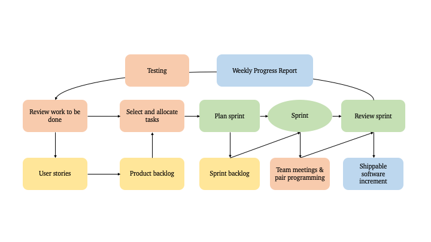
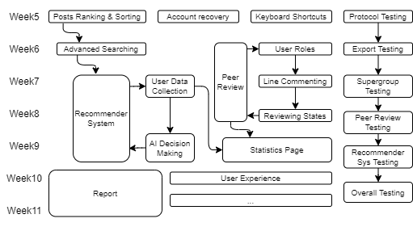

# Deliverable 3 Report

  ## Supergroup C - Team 3

| Name/ ID | Role |
| --- | --- |
| Edwin Brady | Supervisor |
| 190003657  | Git Master |
| 200012696 | Supergroup Rep |
| 190020048 | Scrum Master |
| 200013403 | Tester |
| 190013199 | Product Owner |

# Overview - 190003657

In this deliverable, we continued to iterate on what we had completed in our MVP by improving the current site, streamlining development, and continuing to develop following the agile methodology.

For improving our current site, we have implemented the following features, in addition to progressing on already present ones:
- Semi-infinite scrolling
- Export button on posts
- Downloading of files in a post
- Deletion of posts
- Editing of posts
- Creating comments
- Deleting comments
- Supergroup login
- Supergroup import/ export

For streamlining development, scripts have been written to start up and set up both local and server side sites, along with scripts to login to the group account. Documentation on these scripts and other parts of the program have been written into readme files and parts of the wiki.

We have also been having weekly scrum meetings, where we talk about what we have accomplished and what we hope to accomplish in the incoming week. In addition to this, we've been keeping open lines of communication with each other, so that if there are any problems we can solve them as quickly as possible.

In regards to contact with the supergroup - our supergroup representative has continued to meet with their counterparts in other teams to expedite progress on supergroup interaction. We are now in active contact with team 6 and are currently testing our implementation against theirs.

Finally, we hope to continue to progress during this semester in the same manner - following the agile methodology and maintaining our current level of contact with both each other and other teams. 

# Scrum - 190020048

## Organisational Practice

The team adhered to the Scrum development model for project management, and each sprint cycle lasted for a week. At the beginning of a sprint cycle, the product owner would prioritise the items in the product backlog to define the most important features to be developed in a cycle. Completed features are then checked off the list. Items would be returned to the product backlog if they could not be completed within the allocated week for the sprint. The Scrum master would then organise a follow-up review to assess the complications of the task which is not completed in the given time frame. The model below shows our revised sprint cycle. The input to the process is the product backlog, and each process iteration produces a shippable software increment. In-person team meetings and pair programming were incorporated into the cycle to encourage collaborative development and improve team cohesion via knowledge exchange.

   
<b>Figure 1:</b> Revised sprint cycle to improve team cohesion.
  

## User Stories and Scrum Board

The Scrum board was consistently maintained on Microsoft planner. For example, the implementation of the supergroup content sharing protocol would be assigned to members from the sprint backlog. As the team advanced in developing the sprints, tasks would be moved from the product backlog to the sprint backlog. User stories on our board were refined, analysed, and carefully taken into consideration, as they contain insightful descriptions of the wanted features from our business users’ perspectives. Stories allow us to break the code journal features down into a set of manageable and understandable blocks that our stakeholders can relate to. Tasks were marked as completed after subsequent testing and progress reviews.

## Weekly Progress Reports

The ‘Weekly Progress Bullet Journal’ is a documentation system used in Deliverables 1 and 2. It was used to compile weekly progress reports and track the project’s development progress. Before each Scrum meeting, each team member would fill out the progress form by Monday. The form includes three short questions relating to an individual’s progress: ‘What did you do this week?’, ‘What will you do next week?’, ‘Anything blocking your progress’. Members also have the option to schedule a team discussion or code review. The reports serve as reliable documentation for tracking the project progress. Weekly meeting notes and progress reports are attached to the Appendix for reference.

## Meeting Reflections

Reflecting upon the weekly Scrum meetings, the team was involved in selecting the highest priority of tasks we believe could be completed. With the team’s collaborative effort, we came up with estimates of how much product backlog our team can cover in a single sprint. Understanding our team’s velocity is crucial as it provides a basis for measuring improving performance. Scrum meetings were conducted on Microsoft Teams, while Discord was used for informal updates and discussions. All team members would describe their progress since the last sprint cycle and bring up any problems they have encountered. Everyone participates in short-term planning and there is no top-down management for team organisation. At the end of a sprint, there would be a follow-up review which allows the team to reflect on how things could have been done better and ensure the deliverable will be completed on time.

# Super Group Interaction - 200012696
Our designated Super Group representative (200012696) attended regular super group meetings, with representatives from other super groups. This was done on a Microsoft Teams channel. During these meetings we were able to raise ours concern and questions about the supergroup protocol which is being used for file sharing and login. The supergroup meeting frequency has decreased, due to the main protocol being defined already.

We have used a tool called ‘swagger’ for the API endpoint documentation for the super group.

The Super group representative had been able to schedule time with other groups in the super group to test our implementation of the protocol with theirs. This will enable us to see whether our implementations are compatible with the supergroup or if we need to make any amendments.

# Currently Implemented Functionality - 190013199

## Overview of main features

The core functionality and features from the previous deliverable are completed. User Registration, Logging in, uploading posts, and posting comments remain fully operational. We have now transitioned to developing new features as well as building on our existing features, as well as building up the infrastructure to support planned advanced functionality.

## Supergroup Functionality

All our supergroup functionality such as logging in to other journals and the transmission/reception of data as required by the super group protocol has been ‘completed’ and is now undergoing the final testing stage. We have set up the school nginx and started looking at the Gitlab CI/CD runner for our project; Thanks to constructive emails from fixit we now have
the environment set up for testing our solution amongst that of other groups (some of which we are now in
direct contact with) and this is what we are currently doing.

Naturally, as we are yet to fully test these features, we expect to encounter bugs and other issues so additional modification for our supergroup features will most likely be necessary. However, unless we have overlooked something important, it is likely that work on this is now nearing completion; We expect our supergroup functionality to work with all groups who have accurately followed the protocol.

## New features

We have implemented a text editor that allows the author of a post to modify their submission. This feature works like any text editor you would expect, allowing you to edit any line of the submission and line numbers will update accordingly as the text is editied. The ability to cancel an edit has also been implemented, as well as deleting the post entirely. Note that these features are exclusively available to the author of a post and only the author can edit or delete their post.

Similarly, the ability to delete your comments has been fully implemented alongside reactive front-end buttons that have been designed to prompt the user to confirm the deletion in the least intrusive way possible. Upon pressing the delete comment, the user is presented an option to confirm or cancel via 2 new buttons that dynamically replace it. Deleting is only available to the author of a comment. A 'flag' button is also present on all comments that do not belong to you but this feature is not currently developed.

Alongside showing all posts on the site, it is now possible to only show posts that you, the logged in user, has submitted - making it easier to find your own submissions. Complementing this, the website will now only load up to a set number of posts at a given time and a 'load more posts' button has been added which is our way of showing all the posts without having all the posts being loaded in one attempt.

Front end UI elements for post metrics have now been fully implemented featuring buttons for upvoting, downvoting, and favoriting posts. These features are yet to be connected but are fully responsive and will be implemented in the coming days. Keyboard shortcuts have also been developed which improve the accesibility of our website by providing alternative ways of accessing our functionality to those who may struggle to do so the conventional way.

# Changes made based on feedback and current progress. - 190003657

We have had some reorganisation based on what we have found to be our strengths and weaknesses in order to better deliver the features we've set out to have on our site. In addition to this, we now maintain good contact with each other, clearly stating what it is we're each working on and talking about any problems we have when they pop up. 

We're making good progress currently as well, having almost fully implemented all core functionality set out in the MVP and developed many extra features that we had set out for ourselves in the original user stories, in addition to new ideas we have come up with during scrum meetings as well.

Otherwise, we've for the most part continued along like we have last semester. Just that we are more organised and have figured out how to work better together to deliver the features we've promised our users.

# Future Plan - 200013403

## Making plans with Agile

``In preparing for battle I have always found that plans are useless, but planning is indispensable.'' - Dwight David Eisenhower. During the development process, the pace of change is lightning fast. Although we have a detailed upfront plan at the beginning and follow it all the way through, the requirements usually change by the time the solution is developed and tested. With agile, we leverage short-term planning to discover insights that can help us improve along the way.

## Product Roadmap for the rest of the semester

   
<b>Figure 2:</b> Customer-centric Agile Roadmap with limitless flexibility.
  

Below are some major aspects in our future plan:

- **Peer Review**
  - According to the role of different users, we plan to break down the functions of each user:
    - **Administrator**: manage and control the permission of specified posts and users
    - **Reviewer**: review other users' posts and decide if they can be published/released
    - **Poster:** upload, export/import posts; have access to other posts
  - Post authors can indicate that their post is awaiting peer review.
  - An altered version of the editor is required: reviewers can click on any of the line numbers to write a comment pointing to that line and all the comments would be saved in their own thread.
  - Once done user can then save the review and it gets added in a pending status.
  - Next, the author would be able to go in and respond indicating if each comment/suggestion has been accepted or declined (with a reason attached).
  - Then it is sent to the user who would then be able to comment on additional changes or if they are satisfied, approve the changes.
  - Once at least 2 different people have gone through the review process and have said that they are satisfied, the post could be classified as 'peer-reviewed' in the system.
- **Recommender System**
  - A recommender system seeks to predict the "rating" or "preference" a user would give to a post. 
  - Our recommender system will build a model from users' favorites, posts' tags and rankings. This model is then used to predict items that the user may have an interest in which will directly affect users' homepage post list.
  - Some most successful recommender systems in the industry are built by neural networks such as Deep Neural Networks for YouTube Recommendation. However, we are not going to build it by neural networks because of the lack of real data points. Instead, to gain a deeper understanding of what we learn from CS3105, we plan to implement it with decision-making algorithms such as decision trees or random forests.
- **User Experience and HCI**
  - Following the 10 Usability Heuristics for User Interface Design guidelines by Jakob Nielsen, we plan to redesign the user interface in order to provide the best user experience, particularly in the visibility of system status, error prevention, flexibility/efficiency of use and documentation.

# Conclusion - 200013403

In the first half of Semester 2, everyone is satisfied with their own roles in the team. We co-operated well and gave support to members who were struggling. By combining long-term plans and short-term plans together, we always are clear and specific with the targets and avoid layering them with emotion. Team members view criticism as an opportunity for them to improve, develop, and grow within the team. We already had a working system and we plan to make it better by tackling issues we've identified and improving presently successful features.
